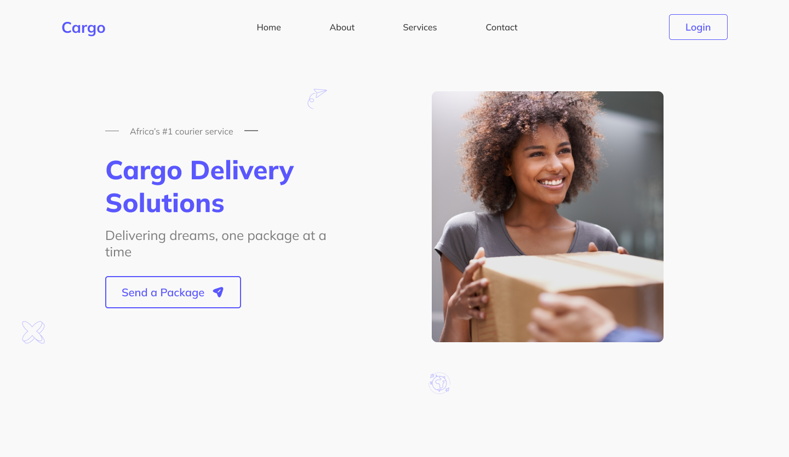

# Cargo Site Landing Page

Welcome to the official repository for the Cargo Site Landing Page project! This project aims to create an engaging and informative landing page for a cargo and logistics website.

## Project Overview

The Cargo Site Landing Page project is designed to provide users with an intuitive interface that highlights the key features and services of our cargo and logistics company. The landing page is built using modern web technologies, including [Vite](https://vitejs.dev/) and [React](https://reactjs.org/), and utilizes the power of [Tailwind CSS](https://tailwindcss.com/) for streamlined styling.

## UI Design

Check out the [UI Design](https://www.behance.net/gallery/178018951/Cargo-landing-page) for a detailed look at the planned visual layout and design elements of the landing page. The UI design showcases the color scheme, typography, imagery, and overall user interface that will be implemented in the final product.

Designed by [DesignMojo](https://www.behance.net/heritageatiba), a talented UI/UX designer with a proven track record of creating stunning and user-friendly interfaces. Make sure to visit their profile to see more of their incredible work!

## Features

- Clear and concise presentation of cargo and logistics services.
- Eye-catching visuals to capture user attention.
- Responsive design for optimal viewing on various devices.
- Easy-to-use navigation for seamless user interaction.

## Getting Started

To get started with the project, follow these steps:

1. Clone this repository: `git clone https://github.com/thamesblanq/cargo_site`
2. Navigate to the project directory: `cd cargo_site`
3. Install dependencies: `npm install`
4. Run the development server: `npm run dev`
5. Open your browser and navigate to `http://localhost:5173` to see the current progress.
6. Start customizing the content and design according to your cargo company's branding.

Feel free to contribute to the project by creating issues, suggesting enhancements, or submitting pull requests. Let's work together to create an exceptional landing page that showcases our cargo and logistics services effectively!

## License

This project is licensed under the [MIT License](LICENSE).

---

*Note: The images used in this README are placeholders and do not represent the actual landing page design.*
